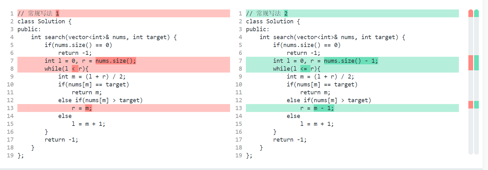

`704. 二分查找` https://leetcode-cn.com/problems/binary-search/solution/er-fen-cha-zhao-by-leetcode/
- [x] 方法：二分查找

【[:star:][`*`]】 二分查找细节详解，顺便赋诗一首 https://leetcode-cn.com/problems/binary-search/solution/er-fen-cha-zhao-xiang-jie-by-labuladong/
>> //notes：这篇文章最好的地方是明确了`搜索区间`这个概念吧。
```console
# 个人笔记例子

假定 nums = [0,1,2], target = 0. 首先考虑**左闭右闭**的情况：
第一轮 mid = (0 + 2)/2 = 1，nums[mid] == 1 > target == 0，需要right左移到mid-1的位置，也就是right变为0。 // 此时因为while循环条件
    是 <=，所以还会继续下一轮。但是要是while循环条件内用 <，对于 left = right = 0 这种情况就会直接返回，也就是会漏掉正确答案了。
第二轮 mid = (0 + 0)/2 = 0, nums[mid] == 0 等于 target == 0，找到答案。
```
- > 本文就来探究几个最常用的二分查找场景：寻找一个数、寻找左侧边界、寻找右侧边界。而且，我们就是要深入细节，比如不等号是否应该带等号，mid 是否应该加一等等。分析这些细节的差异以及出现这些差异的原因，保证你能灵活准确地写出正确的二分查找算法。
- > **零、二分查找框架**
  * > 另外声明一下，计算 mid 时需要防止溢出，代码中 `left + (right - left) / 2` 就和 `(left + right) / 2` 的结果相同，但是有效防止了 left 和 right 太大直接相加导致溢出。
- > **一、寻找一个数（基本的二分搜索）**
  * > **1、为什么 while 循环的条件中是 <=，而不是 <？**
    + > 我们这个算法中使用的是前者 `[left, right]` 两端都闭的区间。**这个区间其实就是每次进行搜索的区间**。
    + > 但如果没找到，就需要 while 循环终止，然后返回 -1。那 while 循环什么时候应该终止？**搜索区间为空的时候应该终止**，意味着你没得找了，就等于没找到嘛。
      >
      > `while(left <= right)` 的终止条件是 `left == right + 1`，写成区间的形式就是 `[right + 1, right]`，或者带个具体的数字进去 `[3, 2]`，可见这时候区间为空，因为没有数字既大于等于 3 又小于等于 2 的吧。所以这时候 while 循环终止是正确的，直接返回 -1 即可。
      >
      > `while(left < right)` 的终止条件是 `left == right`，写成区间的形式就是 `[left, right]`，或者带个具体的数字进去 `[2, 2]`，这时候区间非空，还有一个数 2，但此时 while 循环终止了。也就是说这区间 `[2, 2]` 被漏掉了，索引 2 没有被搜索，如果这时候直接返回 -1 就是错误的。
  * > **2、为什么 `left = mid + 1`，`right = mid - 1`？我看有的代码是 `right = mid` 或者 `left = mid`，没有这些加加减减，到底怎么回事，怎么判断？**
    + > 刚才明确了「**搜索区间**」这个概念，而且本算法的搜索区间是两端都闭的，即 `[left, right]`。那么当我们发现索引 mid 不是要找的 target 时，下一步应该去搜索哪里呢？当然是去搜索 `[left, mid-1]` 或者 `[mid+1, right]` 对不对？因为 mid 已经搜索过，应该从搜索区间中去除。
  * > **3、此算法有什么缺陷？**
    + > 比如说给你有序数组 `nums = [1,2,2,2,3]`，`target` 为 2，此算法返回的索引是 `2`，没错。但是如果我想得到 target 的**左侧边界**，即索引 `1`，或者我想得到 target 的**右侧边界**，即索引 `3`，这样的话此算法是无法处理的。
      >
      > 这样的需求很常见，你也许会说，找到一个 target，然后向左或向右线性搜索不行吗？可以，但是不好，**因为这样难以保证二分查找对数级的复杂度了**。
- > **二、寻找左侧边界的二分搜索**
- > 点击 [我的主页](https://labuladong.gitbook.io/algo/) 看更多优质文章。
  >> https://labuladong.gitbook.io/algo/

二分查找的 ”循环不变量“ ， 只要理解， 根本不用死记硬背边界条件 https://leetcode-cn.com/problems/binary-search/solution/er-fen-cha-zhao-de-xun-huan-bu-bian-liang-zhi-yao-/
```cpp
// 常规写法 1
class Solution {
public:
    int search(vector<int>& nums, int target) {
        if(nums.size() == 0)
            return -1;
        int l = 0, r = nums.size();
        while(l < r){
            int m = (l + r) / 2;
            if(nums[m] == target)
                return m;
            else if(nums[m] > target)
                r = m;
            else
                l = m + 1;
        }
        return -1;
    }
};
```
```cpp
// 常规写法 2
class Solution {
public:
    int search(vector<int>& nums, int target) {
        if(nums.size() == 0)
            return -1;
        int l = 0, r = nums.size() - 1;
        while(l <= r){
            int m = (l + r) / 2;
            if(nums[m] == target)
                return m;
            else if(nums[m] > target)
                r = m - 1;
            else
                l = m + 1;
        }
        return -1;
    }
};
```
>> //notes: 
>>> 醉了，上传完了发现原来原作者自己已经有标识清楚的对比图了。。。
- > 因为是 **左闭右开** 的循环结束条件的判断中为 `while(l < r)` 因为对于左闭右开的区间 `[2, 2)` 这种数值是无意义的， 所以当 `r = l` 的时候， 就该结束循环了， 所以只有在 `l < r` 才继续循环
- > 因为是 **左闭右开** 的 r 的移动规则为 `r = m` ，因为当前循环查找的为索引为 m 位置的元素(即：（`nums[m] == target`）)， 下一次应该将查找范围的右边界设置为 m 位置的前一个元素（`[l, m - 1]`）， 因为 r 指向最后一个元素的后一个元素， 当 r = m ， 下次的查找范围就为 `[l, r)`即 `[l, m - 1]`

再也不怕女朋友问我二分查找了！【手绘漫画】图解二分查找（修订版） https://leetcode-cn.com/problems/binary-search/solution/zai-ye-bu-pa-nu-peng-you-wen-wo-er-fen-cha-zhao-li/

# part 1

时间顺序上目前是：
- `deliberate-WA--000704.py` -- `000704.py` -- `deliberate-test-but-not-expect-RE--000704.py`
  * 在这几个类似的实现下，我们会发现right必须要取 length-1，while循环时必须用小于等于，=号不能少。至于left，肯定得取下标0（也就是得闭区间），不然假设要查的目标值就是数组第一个数，从下标1开始怎么可能查得到。

```
# 几个测试用例：

[-1,0,3,5,9,12]
9
[-1,0,3,5,9,12]
2
[-1,2,3,5,9,12]
2
[5]
5
[-1,0,3,5,9,12]
13
```

# part 2

但是实际上各语言官方lib的实现在这两处都跟我第一类实现不一样，C++和Python官方的实现都是：
- left和right（或者first-last、lo-hi，叫法很多，都一个意思）取得是`左闭右开`。
- while那里只取小于，不取等于。
- 左边界left增长时是取：`left = mid + 1`，右边界right减少时却是取：`right = mid`（我的写法是`right = mid - 1`）。
- 如果能查到结果，return的不是`mid`，是`left`。

>> //notes：回头再细细揣摩下，两个官方都这么写，肯定是有原因的。我的倒是和这个链接（[《Python实现二分查找与bisect模块详解》](https://www.jb51.net/article/102899.htm)）里的第二种实现类似，但我确实是自己先写完了才发现的- -
```py
我们分别用递归和循环来实现二分查找：

def binary_search_recursion(lst, value, low, high): 
 if high < low: 
 return None
 mid = (low + high) / 2
 if lst[mid] > value: 
 return binary_search_recursion(lst, value, low, mid-1) 
 elif lst[mid] < value: 
 return binary_search_recursion(lst, value, mid+1, high) 
 else: 
 return mid 

def binary_search_loop(lst,value): 
 low, high = 0, len(lst)-1
 while low <= high: 
 mid = (low + high) / 2
 if lst[mid] < value: 
 low = mid + 1
 elif lst[mid] > value: 
 high = mid - 1
 else:
 return mid 
 return None
```
>> //notes：当然，也不必气馁觉得自己就写得很差，因为LeetCode官方的答案也是这么写的（那四个点的写法和我的写法是一样的：(1)边界取`左闭右闭`；(2)while循环用`<=`；(3)右边界减少时用的是`right=mid-1`；(4)如果能找到最后返回的是`mid`。）：
```py3
class Solution:
    def search(self, nums: List[int], target: int) -> int:
        left, right = 0, len(nums) - 1
        while left <= right:
            pivot = left + (right - left) // 2
            if nums[pivot] == target:
                return pivot
            if target < nums[pivot]:
                right = pivot - 1
            else:
                left = pivot + 1
        return -1
```

# 参考链接：

二分查找有几种写法？它们的区别是什么？ - Jason Li的回答 - 知乎 https://www.zhihu.com/question/36132386/answer/530313852

`std::lower_bound` https://en.cppreference.com/w/cpp/algorithm/lower_bound

`def bisect_left(a, x, lo=0, hi=None):` https://github.com/python/cpython/blob/2.7/Lib/bisect.py#L67
```py
def bisect_left(a, x, lo=0, hi=None):
    """Return the index where to insert item x in list a, assuming a is sorted.

    The return value i is such that all e in a[:i] have e < x, and all e in
    a[i:] have e >= x.  So if x already appears in the list, a.insert(x) will
    insert just before the leftmost x already there.

    Optional args lo (default 0) and hi (default len(a)) bound the
    slice of a to be searched.
    """

    if lo < 0:
        raise ValueError('lo must be non-negative')
    if hi is None:
        hi = len(a)
    while lo < hi:
        mid = (lo+hi)//2
        if a[mid] < x: lo = mid+1
        else: hi = mid
    return lo
```

# 测试用例

```
[-1,0,3,5,9,12]
9
[-1,0,3,5,9,12]
2
```
